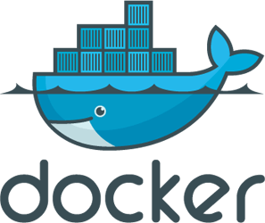

% Docker使ってみた
% yamotonalds
% 2015-08-26

## 最近、Dockerを触り始めました。



## Dockerって？

コンテナを作成・操作するプラットフォーム。

軽量なVMみたいな感じ。

## 何に使ったの？

* samidare gemの動作確認
* botのお家

# なんでDocker？

## マシンをそのまま使ってたら…

* 他の環境を壊す可能性
    * 共用マシンですしおすし
* 別バージョンのミドルウェアが同時に必要になったら？
    * MySQLとか🐬
* 秘伝のタレ化
    * 自分でも再現できない＼(\^o\^)／

## Dockerを使うと…

* コンテナ（隔離~~病棟~~環境）だから好き放題できる！
    * まっさらな環境で試せる！
* 別バージョンのミドルウェアでも特別なことは不要！
* Dockerfileでイメージ作成手順をコード化できる！
* **コンテナ作成が爆速！** ←重要

## Dockerの使用用途

* 検証環境
* 作業環境
* アプリ実行環境
* CI環境
* cron,bot,etc...

なんでもできる。（ん？）

# コンテナ外部からのアクセス

## EXPOSE

* 公開するポート番号を指定
    * `docker run -P`
* 無くてもコンテナ実行時に`-p`オプションで指定可能
    * `docker run -p 8080:80`

## link

* `docker run --link <コンテナ名>:<Alias>`
* `<Alias>`に応じた環境変数が定義される
    * 例（\<Alias\> = mysql）
    ```
    MYSQL_PORT=tcp://172.17.0.36:3306
    MYSQL_PORT_3306_TCP=tcp://172.17.0.36:3306
    MYSQL_PORT_3306_TCP_ADDR=172.17.0.36
    MYSQL_PORT_3306_TCP_PORT=3306
    MYSQL_PORT_3306_TCP_PROTO=tcp
    ```

# データの共有

## mount

ホストマシンのファイルをコンテナにマウントできる。

`docker run -v /my/local/path:/var/data/hoge`

# 環境変数

##

`docker run -e HOGE=hoge`

# 実演タイム

##

* docker images
    * 入っているイメージを表示
    * 必要なら[Docker Hub](https://hub.docker.com/)から取ってくる
        * `docker search`
        * `docker pull`
* docker build
    * Dockerfileを元にイメージを作成

##

* docker run
    * イメージを指定してコンテナを作成（実行）
    * `--name`で名前を付ける
    * 実行モード
        * `-d` … daemon実行。ずっと動かし続ける場合。
        * `-it` … インタラクティブ実行。`bash`等と組み合わせて対話的に。
* docker ps
    * 実行中のコンテナを表示
    * `-a`で終了したコンテナも見れる

##

* docker rm
    * コンテナを削除する
* docker rmi
    * イメージを削除する

# Dockerfileの書き方

## よく使いそうなstatement

* FROM … ベースイメージ
* RUN … ビルド時に実行するコマンド
* ENV … 環境変数
* ADD or COPY … ファイルの埋め込み。ADDはURL指定やアーカイブ展開できる
* CMD … `docker run`時のデフォルトコマンド

## レイヤー数に注意

* 親も合わせて127レイヤー(statement)まで。
    * 関連するコマンドを1コマンドにまとめる
    * シェルスクリプトファイルにまとめる
    * プロビジョニングツールを使う

## Dockerfileでコード化

. . .

秘伝のタレにしない

## docker commitコマンド

. . .

ポータブル秘伝のタレ

. . .

業が深くなるだけな気がする

# 今後やってみたいこと

## CI環境構築

* テストジョブ毎に新規の閉じた環境でテストできる
    * 並列実行も簡単そう？
* jenkins自体のimageも配布されてるぽい

# ご清聴ありがとうございました
